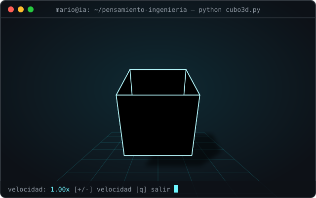

<div align="center">


<br/>


</div>

---

## 🧠 Sobre el repositorio

Repositorio de la clase de **Pensamiento de Ingeniería** en **Inteligencia Artificial**.

---

## 🎲 Cubo 3D en la terminal

<div align="center">

</div>

Un cubo 3D renderizado en ASCII directamente en la terminal, sin librerías externas:

- **Rotación 3D** con matrices de rotación en los tres ejes.
- **Proyección en perspectiva** y **z-buffer** para resolver qué se ve y qué no.
- **Iluminación difusa** calculada con el producto punto entre la normal de cada cara y la luz.
- **Sombra proyectada** sobre un piso de tablero, siguiendo la dirección de la luz.
- **Pantalla completa** en la pantalla alternativa de la terminal; al salir todo vuelve como estaba.

### ▶️ Ejecutar

```bash
python cubo3d.py
```

### 🎮 Controles

| Tecla | Acción |
|:-----:|--------|
| `+` | Más rápido |
| `-` | Más lento |
| `q` | Salir |

---

## 📂 Estructura

```
.
├── cubo3d.py          # Cubo 3D rotando en terminal
├── assets/
│   └── cubo3d.svg     # Animación del README
└── README.md
```

---

<div align="center">


</div>
